<!-- Custom motion assets are stored in this repository. -->

  

# 👋 Hi, I'm Somyajit 

🚀 **Aspiring AI Engineer | Full Stack Developer | C++ Enthusiast**

I'm passionate about building intelligent software and continuously learning new technologies.

  

## 🧠 Currently Learning

* 🤖 Artificial Intelligence
* 🧩 Machine Learning & Deep Learning
* ⚡ AI Agents
* 💻 C++ & Algorithms (DSA)
* 🌐 Full Stack Web Development
* 🏗️ System Design

## 🎯 Goals

* 🚀 Build impactful AI projects
* 🌍 Contribute to Open Source
* 📚 Learn something new every day

> **"Learn • Build • Iterate • Repeat."** 🚀

## ⚡ Neural Lab

  

---

## 🐍 Contributions in motion

<picture>
  <source media="(prefers-color-scheme: dark)" srcset="https://raw.githubusercontent.com/LowkyFoolDev/LowkyFoolDev/refs/heads/output/github-snake-dark.svg" />
  <source media="(prefers-color-scheme: light)" srcset="https://raw.githubusercontent.com/LowkyFoolDev/LowkyFoolDev/refs/heads/output/github-snake.svg" />
  
</picture>

Refreshed daily with <a href="https://github.com/Platane/snk">Platane/snk</a> · <a href="https://github.com/LowkyFoolDev/LowkyFoolDev/actions/workflows/snake.yml">Animation workflow</a>
